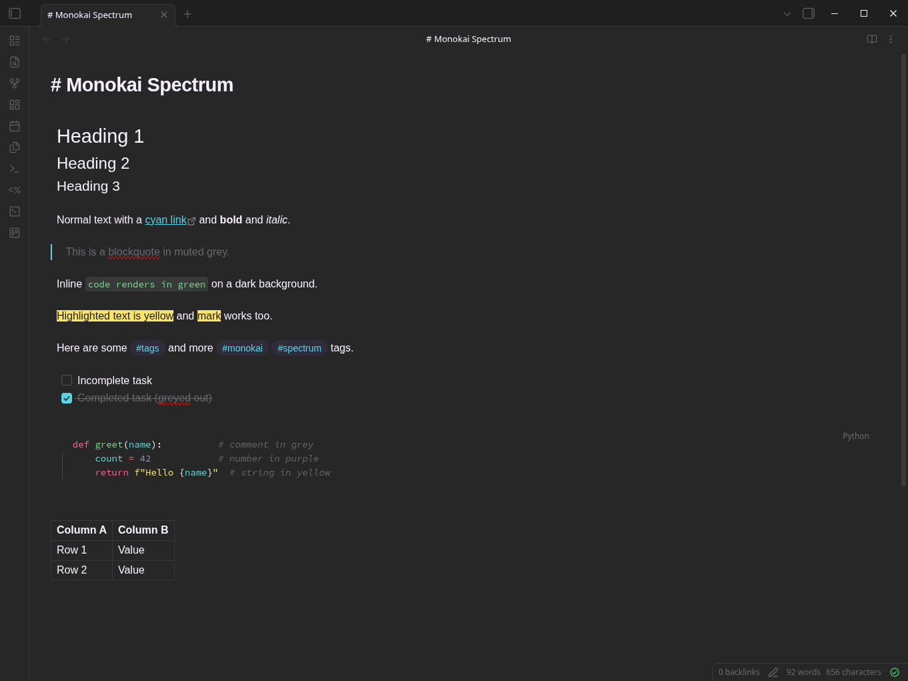

# Monokai Spectrum for Obsidian

A dark Obsidian theme adapted from the **Monokai Pro "Filter Spectrum"** color palette by [Monokai](https://monokai.pro/).

Spectrum uses cool, near-black neutrals with a subtle violet cast and vivid electric accents — magenta-pink, lemon yellow, electric cyan, lime green, and violet.

## Attribution

The CSS structure is based on [Monokai Ristretto for Obsidian](https://github.com/vinitkumar/monokai-ristretto-obsidian) by [Vinit Kumar](https://github.com/vinitkumar), which adapts the Monokai Pro "Filter Ristretto" variant. This theme applies the Spectrum palette in its place.

## License

MIT
